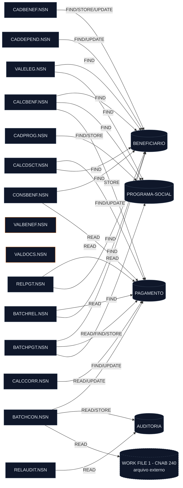

<!-- markdownlint-disable MD013 MD025 MD026 MD028 MD029 MD034 MD040 MD051 MD060 -->

# Mapa de Dependências — SIFAP Legado

  

> 🗺 **Você está aqui:** [Kit PT-BR](../README.md) → [Estágio 1](README.md) → **dependency-map**

> **Para quem é isto?** Este é um **artefato preenchido pelo time** durante o Estágio 1 (Arqueologia).
>
> **O que você terá ao final do estágio:**
>
> 1. Este documento totalmente preenchido com os dados reais do legado SIFAP
> 2. Rastreabilidade para `01-arqueologia/legado-sifap/` (programas `.NSN` e DDMs)
> 3. Base de evidência usada nas EARS do Estágio 2 (`source_legacy:`)
>
> 📘 **Guia passo a passo:** [`GUIDE.md`](GUIDE.md).

> Mapa **gerado por `/map-dependencies`** em 2026-06-10. **Escopo:** `01-arqueologia/legado-sifap/natural-programs/`
> (15 programas `.NSN`, 4 DDMs) — recursivo. Toda aresta abaixo cita **arquivo + linha** reais.
> Versão Mermaid isolada em [`dependency-map.mmd`](dependency-map.mmd).

> ⚠️ **Achado central:** **não existe nenhum `CALLNAT` nem `INCLUDE`** nos 15 programas materializados
> (verificado por `grep`). Logo **não há arestas programa→programa**. Toda a integração entre
> programas é **implícita, via DDMs Adabas compartilhados** (acoplamento por dados, não por chamada).
> Isso confirma o MYS-023: o batch reimplementa a lógica inline em vez de chamar `CALCBENF`/`CALCDSCT`.

## Diagrama Mermaid

> Nós retangulares = programas; cilindros = DDMs/arquivos de dados; arestas rotuladas pela operação
> (READ/FIND/STORE/UPDATE). `VALBENEF` e `VALDOCS` aparecem **sem arestas** — são órfãos (ver Observações).

## Arestas Programa-para-Programa

| Origem | Alvo | Tipo | Arquivo | Linha |
| ------ | ---- | ---- | ------- | ----- |
| — | — | CALLNAT | — | **Nenhuma encontrada** |
| — | — | INCLUDE | — | **Nenhuma encontrada** |

> Busca por `CALLNAT` e `INCLUDE` nos 15 `.NSN` retornou **zero ocorrências**. Não há grafo de
> chamadas inter-program no código materializado. O cabeçalho de `BATCHPGT` promete chamar
> `CALCBENF`/`CALCDSCT`, mas a chamada **não existe** — a lógica foi copiada inline
> ([business-rules-catalog.md, BATCHPGT #6](business-rules-catalog.md); MYS-023).

### Sub-rotinas internas (PERFORM — dependências intra-program, sem aresta no grafo)

| Programa | Sub-rotina (PERFORM) | Linha(s) |
| -------- | -------------------- | -------- |
| CADBENEF | VALIDA-CPF | L112 |
| CADDEPEND | _(nenhum PERFORM)_ | — |
| CADPROG | CONSULTA-PROG | L57 |
| CALCBENF | DET-FAIXA-RENDA · CALC-DESCONTOS | L202 · L263 |
| CALCCORR | CALC-INDICE-ACUM | L149 |
| CALCDSCT | CALC-CONTRIB-SOCIAL | L99 |
| VALELEG | VERIF-ELEG-ESPECIFICA | L207 |
| VALBENEF | VALIDA-CPF-COMPLETO · VALIDA-DATA · VALIDA-NOME | L115 · L125 · L135 |
| VALDOCS | VALIDA-CPF-DOC · VALIDA-RG · CHECK-DOC-ESPECIAL | L68 · L78 · L88 |
| CONSBENF | MASCARA-CPF | L107 |
| RELPGT | IMPRIME-SUBTOTAL · IMPRIME-CABECALHO | L94, L174 · L145 |
| RELAUDIT | IMPRIME-CAB-AUDIT | L165 |
| BATCHPGT | DET-FAIXA-RENDA-BATCH | L262 |
| BATCHCON | GRAVA-AUDITORIA-DIVERG · GRAVA-AUDITORIA-CONC · ~~CONCILIA-REAL~~ (comentado, morto) | L167 · L201 · L222 |
| BATCHREL | IMPRIME-CABECALHO | L172 |

## Arestas Programa-para-Dados

> View → DDM (DEFINE DATA): `BENEFICIARIO-V`→`BENEFICIARIO`, `PROGRAMA-V`→`PROGRAMA-SOCIAL`,
> `PAGAMENTO-V`→`PAGAMENTO`, `AUDITORIA-V`→`AUDITORIA`.

| Programa | DDM/Arquivo | Operação | Descritor / Chave | Arquivo | Linha |
| -------- | ----------- | -------- | ----------------- | ------- | ----- |
| CADBENEF | BENEFICIARIO | FIND | CPF | CADBENEF.NSN | L139, L201 |
| CADBENEF | BENEFICIARIO | STORE | — | CADBENEF.NSN | L197 |
| CADBENEF | BENEFICIARIO | UPDATE | — | CADBENEF.NSN | L213 |
| CADDEPEND | BENEFICIARIO | FIND | CPF (titular) | CADDEPEND.NSN | L46, L95, L110 |
| CADDEPEND | BENEFICIARIO | UPDATE | — | CADDEPEND.NSN | L120 |
| CADPROG | PROGRAMA-SOCIAL | FIND | COD-PROGRAMA | CADPROG.NSN | L77, L109 |
| CADPROG | PROGRAMA-SOCIAL | STORE | — | CADPROG.NSN | L102 |
| CALCBENF | BENEFICIARIO | FIND | CPF | CALCBENF.NSN | L148 |
| CALCBENF | PROGRAMA-SOCIAL | FIND | COD-PROGRAMA | CALCBENF.NSN | L167 |
| CALCBENF | PAGAMENTO | STORE | — | CALCBENF.NSN | L286 |
| CALCCORR | PAGAMENTO | READ | CPF-BENEF | CALCCORR.NSN | L128 |
| CALCCORR | PAGAMENTO | UPDATE | — | CALCCORR.NSN | L162 |
| CALCDSCT | PAGAMENTO | FIND | NUM-PAGTO | CALCDSCT.NSN | L74, L179 |
| CALCDSCT | BENEFICIARIO | FIND | CPF | CALCDSCT.NSN | L88, L108 |
| CALCDSCT | PAGAMENTO | UPDATE | — | CALCDSCT.NSN | L181 |
| VALELEG | BENEFICIARIO | FIND | CPF | VALELEG.NSN | L70 |
| VALELEG | PROGRAMA-SOCIAL | FIND | COD-PROGRAMA | VALELEG.NSN | L88 |
| CONSBENF | BENEFICIARIO | FIND | CPF / NIS | CONSBENF.NSN | L88 / L92 |
| CONSBENF | PAGAMENTO | READ | CPF-BENEF | CONSBENF.NSN | L151 |
| RELPGT | PAGAMENTO | READ | COMPETENCIA | RELPGT.NSN | L82 |
| RELPGT | BENEFICIARIO | FIND | CPF | RELPGT.NSN | L104 |
| RELAUDIT | AUDITORIA | READ | DT-EVENTO | RELAUDIT.NSN | L92 |
| BATCHPGT | PAGAMENTO | READ | NUM-PAGTO (DESCENDING) | BATCHPGT.NSN | L171 |
| BATCHPGT | BENEFICIARIO | READ | CPF | BATCHPGT.NSN | L182 |
| BATCHPGT | PAGAMENTO | FIND | CPF-BENEF | BATCHPGT.NSN | L202 |
| BATCHPGT | PROGRAMA-SOCIAL | FIND | COD-PROGRAMA | BATCHPGT.NSN | L214 |
| BATCHPGT | PAGAMENTO | STORE | — | BATCHPGT.NSN | L335 |
| BATCHCON | AUDITORIA | READ | SEQ-AUDIT (DESCENDING) | BATCHCON.NSN | L88 |
| BATCHCON | WORK FILE 1 (CNAB 240, externo) | READ | — | BATCHCON.NSN | L106 |
| BATCHCON | PAGAMENTO | FIND | NUM-PAGTO | BATCHCON.NSN | L139, L173, L182, L189 |
| BATCHCON | PAGAMENTO | UPDATE | — | BATCHCON.NSN | L178, L185, L192 |
| BATCHCON | AUDITORIA | STORE | — | BATCHCON.NSN | L249, L268 |
| BATCHREL | PAGAMENTO | READ | COMPETENCIA | BATCHREL.NSN | L105 |
| BATCHREL | BENEFICIARIO | FIND | CPF | BATCHREL.NSN | L112 |

> Operações **GET, DELETE e HISTOGRAM**: nenhuma ocorrência no escopo.

## Referências Quebradas

- **Nenhuma aresta quebrada de CALLNAT/INCLUDE** — porque não há nenhum CALLNAT/INCLUDE no código.
- ⚠️ **Subprogramas esperados, porém ausentes da pasta** (citados na documentação / cabeçalhos, mas
  **não materializados** entre os 15 `.NSN`, e **nunca chamados** no código): `VALCPF`, `VALNISN`,
  copycode `FMTVLR`. Ver [inventory.md, "Itens Incomuns"](inventory.md). Como não há CALLNAT real,
  não geram aresta — ficam registrados como lacuna de artefato.
  <!-- mystery: subprogramas VALCPF, VALNISN e copycode FMTVLR são citados na documentação e em cabeçalhos de programa, mas não existem entre os 15 .NSN e nunca são chamados (zero CALLNAT/INCLUDE em todo o código). Falta saber se foram perdidos na extração do legado, renomeados, ou se a lógica foi inlined. A validação de NIS (RN-001 via VALNISN) não acontece em lugar nenhum materializado. -->
- ⚠️ **Fonte de dados externa:** `BATCHCON` lê `WORK FILE 1` (arquivo de retorno bancário CNAB 240)
  em `BATCHCON.NSN#L106` — não é DDM Adabas; é entrada externa. Há um `READ WORK FILE 2` **comentado**
  (`BATCHCON.NSN#L213`), bloco morto da integração Banco Real (MYS-024).

## Dependências Circulares

- **Nenhuma.** Sem arestas programa→programa, não há ciclos de chamada. (Ciclos por dados
  compartilhados — ex.: vários programas escrevem em `PAGAMENTO` — não constituem dependência
  circular de chamada.)

## Programas Órfãos

> Programas **sem nenhuma aresta** no grafo (não acessam DDM e não são chamados por ninguém):

- **`VALBENEF.NSN`** e **`VALDOCS.NSN`** — declaram `VIEW OF BENEFICIARIO` no `DEFINE DATA`, mas
  **não executam nenhuma operação de acesso** (sem READ/FIND/STORE/UPDATE) e **não há CALLNAT** que
  os invoque. São validadores que operam sobre dados recebidos por parâmetro, presumivelmente
  destinados a serem chamados via CALLNAT (que não existe). **Órfãos/possível código não integrado.**
  <!-- mystery: VALBENEF.NSN e VALDOCS.NSN são órfãos — não acessam DDM e nenhum programa os chama (zero CALLNAT em todo o legado). Contêm a validação de CPF (mod-11), data, nome, RG e os backdoors de prefixo (MYS-019/MYS-021), mas ninguém materializado os invoca. Falta saber se são código morto/não integrado ou se eram chamados por programas online (MAP) ausentes da pasta. Relaciona-se com MYS-005 (CADDEPEND não valida CPF/data do dependente). -->

> Observação: todos os demais 13 programas têm ao menos uma aresta de dados, então **não são órfãos
> de dados**; porém, como **nenhum** programa é chamado por outro, todos os 15 são, tecnicamente,
> **pontos de entrada independentes** (online 3270 ou JCL batch).

## Observações

- **Total de programas no escopo:** 15 · **DDMs:** 4 (+ 1 arquivo externo CNAB).
- **Arestas programa→programa:** 0 (sem CALLNAT/INCLUDE).
- **Arestas programa→dados:** 34 (linhas da tabela acima), envolvendo 13 programas.
- **Programa mais conectado (maior grau de dados):** `BATCHCON` (toca PAGAMENTO, AUDITORIA e o
  arquivo CNAB externo, com READ/FIND/UPDATE/STORE) e `BATCHPGT` (toca os 3 DDMs principais:
  BENEFICIARIO, PAGAMENTO, PROGRAMA-SOCIAL).
- **DDM mais acessado (por nº de programas distintos):** `BENEFICIARIO` — 9 programas
  (CADBENEF, CADDEPEND, CALCBENF, CALCDSCT, VALELEG, CONSBENF, RELPGT, BATCHREL, BATCHPGT);
  `PAGAMENTO` vem logo atrás com 8 programas, mas concentra o maior nº de operações de escrita
  (STORE/UPDATE por CALCBENF, CALCCORR, CALCDSCT, BATCHPGT, BATCHCON).
- **Programas órfãos:** `VALBENEF`, `VALDOCS` (sem qualquer aresta).
- **Implicação para o Estágio 2:** a integração do sistema é **toda por dados compartilhados**
  (especialmente `PAGAMENTO` e `BENEFICIARIO`). Qualquer recorte de bounded context precisa tratar a
  propriedade desses dois DDMs como a decisão central — vários módulos escrevem em `PAGAMENTO`.

---

### Continuar a leitura

<table width="100%">
<tr>
<td width="50%" valign="top" align="left">
<strong>← ANTERIOR</strong> 
<a href="business-rules-catalog.md"><strong>business-rules-catalog.md</strong></a> 
Catálogo de regras.
</td>
<td width="50%" valign="top" align="right">
<strong>PRÓXIMO →</strong> 
<a href="discovery-report.md"><strong>discovery-report.md</strong></a> 
Síntese final.
</td>
</tr>
</table>

↑ <a href="README.md">Voltar ao Kit PT-BR</a>

