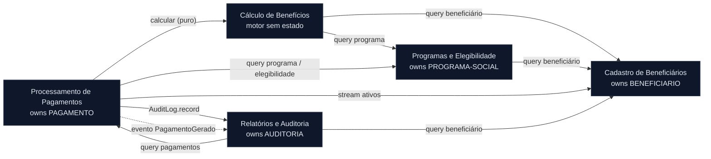

<!-- markdownlint-disable MD013 MD025 MD026 MD028 MD029 MD034 MD040 MD051 MD060 -->

# Mapa de Bounded Contexts — SIFAP Modernizado

  

> 🗺 **Você está aqui:** [Kit PT-BR](../README.md) → [Estágio 2](README.md) → **bounded-contexts**

> **Origem:** `/carve-bounded-contexts` sobre [`01-arqueologia/discovery-report.md`](../01-arqueologia/discovery-report.md)
> (5 hipóteses de recorte), com evidência cruzada de [`business-rules-catalog.md`](../01-arqueologia/business-rules-catalog.md)
> (coesão) e [`dependency-map.md`](../01-arqueologia/dependency-map.md) (acoplamento). **Data:** 2026-06-10.
>
> ⚠️ **As recomendações abaixo aguardam ratificação da equipe.** O `@architect-agent` avalia e propõe;
> a equipe decide. Cada hipótese tem uma linha **Decisão da equipe** a confirmar na conversa de design.

---

## Critérios de Avaliação

Cada hipótese recebe um scorecard **High / Medium / Low** em três eixos:

- **Coesão** — as regras de negócio do grupo pertencem à mesma capacidade? (evidência: [business-rules-catalog.md](../01-arqueologia/business-rules-catalog.md))
- **Acoplamento** — quantas arestas cruzam a fronteira? Baixo acoplamento = fronteira forte. (evidência: [dependency-map.md](../01-arqueologia/dependency-map.md); lembrar: **0 arestas programa→programa** no legado — todo acoplamento é por DDM compartilhado)
- **Frequência de mudança** — programas que historicamente mudam juntos pertencem ao mesmo contexto (proxy: famílias de prefixo + cabeçalhos de alteração no catálogo)

> **Fato estrutural que molda tudo:** `PAGAMENTO` é escrito por **5 programas** de **dois grupos diferentes**
> (Cálculo: CALCBENF/CALCCORR/CALCDSCT; Pagamentos: BATCHPGT/BATCHCON). `BENEFICIARIO` é lido por **9 programas**.
> A propriedade desses dois DDMs é a decisão central do recorte.

---

## Avaliação de Hipóteses

### Hipótese 1: Cadastro de Beneficiários — ACEITA (recomendado)

| Critério | Avaliação | Evidência |
| -------- | --------- | --------- |
| Coesão | **High** | CADBENEF, CADDEPEND, VALBENEF, VALDOCS giram todos em torno do dado da pessoa: CPF mod-11, nome, data, status A/S/C/I/D, documentos ([business-rules-catalog.md, CADBENEF/CADDEPEND/VALBENEF/VALDOCS](../01-arqueologia/business-rules-catalog.md)). |
| Acoplamento | **Medium** | Possui `BENEFICIARIO`; nenhuma leitura sai dele. Porém é o **hub de leitura**: 8 outros programas leem `BENEFICIARIO` (entrada). Resolvido expondo interface de query — não fragiliza a fronteira. |
| Freq. de mudança | **High (coesa)** | Validadores `VALBENEF`/`VALDOCS` são órfãos (MYS-030) mas validam dados de beneficiário — pertencem aqui; trazê-los para dentro integra o código não-conectado. |

**Recomendação:** Aceitar. Absorver os validadores órfãos (MYS-030) e os subprogramas ausentes de CPF/NIS (MYS-031) como serviços internos de validação deste contexto.
**Decisão da equipe:** ☐ aceita como está · ☐ ajustar · ☐ rejeitar — _________________

### Hipótese 2: Programas Sociais e Elegibilidade — ACEITA (recomendado)

| Critério | Avaliação | Evidência |
| -------- | --------- | --------- |
| Coesão | **High** | CADPROG define os parâmetros (TIPO A/P/T, RENDA-MAX, IDADE-MIN/MAX, COD-ELEGIBILIDADE) que VALELEG consome para decidir elegibilidade ([business-rules-catalog.md, CADPROG/VALELEG](../01-arqueologia/business-rules-catalog.md)). |
| Acoplamento | **Medium** | Possui `PROGRAMA-SOCIAL`. VALELEG faz **1 leitura cruzada** de `BENEFICIARIO` ([dependency-map.md, VALELEG→BENEFICIARIO L70](../01-arqueologia/dependency-map.md)). Aceitável via query. |
| Freq. de mudança | **High (coesa)** | Cabeçalhos mostram evolução conjunta das regras de elegibilidade (2004, 2009, 2013 "INC REGIAO 99"). |

**Recomendação:** Aceitar. A elegibilidade é a "guardiã" das regras do programa — coesão forte. O bypass da região 99 (MYS-017) vive aqui e precisa de decisão de segurança.
**Decisão da equipe:** ☐ aceita · ☐ ajustar · ☐ rejeitar — _________________

### Hipótese 3: Cálculo de Benefícios — ACEITA com ajuste (recomendado)

| Critério | Avaliação | Evidência |
| -------- | --------- | --------- |
| Coesão | **High** | CALCBENF, CALCDSCT, CALCCORR concentram toda a matemática financeira: fatores, teto de 30%, IPCA, 13º, abono ([business-rules-catalog.md, CALCBENF/CALCDSCT/CALCCORR](../01-arqueologia/business-rules-catalog.md)). |
| Acoplamento | **High** | Lê `BENEFICIARIO` e `PROGRAMA-SOCIAL` (4 leituras cruzadas) **e** escreve `PAGAMENTO` (STORE/UPDATE). O write em `PAGAMENTO` colide com a Hipótese 4 — **fronteira mal posicionada se o cálculo também persistir**. |
| Freq. de mudança | **High** | Muitas alterações financeiras (2001, 2004, 2009, 2013, 2015). MYS-023: BATCHPGT **duplica** este cálculo inline. |

**Recomendação:** Aceitar **como motor de cálculo sem estado** (owns regras/tabelas de parâmetro, **não** owns `PAGAMENTO`). O cálculo passa a **retornar valores**; quem persiste em `PAGAMENTO` é o contexto de Pagamentos. Isso elimina a dupla fonte da verdade (MYS-023) e o conflito de escrita, baixando o acoplamento de High para Medium.
**Decisão da equipe:** ☐ aceita (motor sem estado) · ☐ manter cálculo persistindo · ☐ mesclar com Hipótese 4 — _________________

### Hipótese 4: Processamento de Pagamentos — ACEITA (recomendado)

| Critério | Avaliação | Evidência |
| -------- | --------- | --------- |
| Coesão | **High** | BATCHPGT (folha mensal) e BATCHCON (conciliação CNAB) gerenciam o ciclo de vida de `PAGAMENTO`: G→P/D/E ([business-rules-catalog.md, BATCHPGT/BATCHCON](../01-arqueologia/business-rules-catalog.md)). |
| Acoplamento | **Medium** | Possui `PAGAMENTO`. Lê `BENEFICIARIO`/`PROGRAMA-SOCIAL` (cross-read) e escreve `AUDITORIA` (cross-write — resolver via interface de auditoria, não acesso direto). |
| Freq. de mudança | **High (coesa)** | Ambos batch, ordenados por CPF, mesma janela de competência; evoluem juntos (2000, 2008, 2014). |

**Recomendação:** Aceitar como **dono de `PAGAMENTO`**. Deve **chamar** o motor de Cálculo (Hipótese 3) in-process em vez de reimplementar (corrige MYS-023). A gravação de auditoria de BATCHCON passa a ser uma chamada à interface do contexto de Auditoria.
**Decisão da equipe:** ☐ aceita · ☐ mesclar com Hipótese 3 · ☐ ajustar — _________________

### Hipótese 5: Consultas, Relatórios e Auditoria — ACEITA com ajuste (recomendado)

| Critério | Avaliação | Evidência |
| -------- | --------- | --------- |
| Coesão | **Medium** | CONSBENF, RELPGT, BATCHREL são **somente-leitura** (consultas/relatórios); RELAUDIT lê a trilha. Coesão de "leitura", mas mistura dois conceitos: **read models** e **trilha de auditoria** ([business-rules-catalog.md, CONSBENF/RELPGT/BATCHREL/RELAUDIT](../01-arqueologia/business-rules-catalog.md)). |
| Acoplamento | **High (leitura)** | Lê `PAGAMENTO`, `BENEFICIARIO`, `AUDITORIA` — muitas leituras cruzadas. Mas é tudo leitura → resolvível com interfaces de query / read models. **Tensão real:** `AUDITORIA` é **escrita** por BATCHCON (Pagamentos), não por este grupo. |
| Freq. de mudança | **Medium** | Relatórios mudam por formatação (2006, 2010, 2013); auditoria por compliance (2014 "LIMPEZA RELATORIO" → MYS-029). |

**Recomendação:** Aceitar, mas **separar o conceito de auditoria**: `AUDITORIA` (log append-only) é exposto como **interface de escrita** consumida por qualquer contexto que muda dados (hoje só BATCHCON). Os relatórios/consultas permanecem como **leitores**. Mantemos um único contexto "Relatórios e Auditoria" que **possui `AUDITORIA`** e expõe `AuditLog.record(event)` para escrita e queries para leitura. MYS-029 (exclusões ocultas) é decisão de compliance deste contexto.
**Decisão da equipe:** ☐ aceita (contexto único Relatórios+Auditoria) · ☐ separar Auditoria como shared kernel · ☐ ajustar — _________________

---

## Bounded Contexts Finais

> 5 contextos recomendados, todos **in-process** (Modular Monolith). Nomes em linguagem de negócio.

### 1. Cadastro de Beneficiários (Beneficiary Registry)

- **Responsabilidade:** Possui o ciclo de vida do beneficiário e seus dependentes/documentos — inclusão, alteração, validação (CPF mod-11, nome, data de nascimento, RG, status A/S/C/I/D) e o grupo de dependentes. É a fonte da verdade sobre "quem é a pessoa".
- **Dados sob ownership:** `BENEFICIARIO` (incl. grupo periódico `DEPENDENTES`).
- **Interface pública:** `findBeneficiario(cpf) : BeneficiarioDTO` · `existsAtivo(cpf) : boolean` · `validarCpf(cpf) : ValidationResult` · `streamAtivos() : Stream<BeneficiarioDTO>` (para o batch).
- **Por que é seu próprio contexto:** Alta coesão em torno de `BENEFICIARIO` e ownership exclusivo de escrita; absorve os validadores órfãos (MYS-030) e a validação de NIS ausente (MYS-031).

### 2. Programas Sociais e Elegibilidade (Social Programs & Eligibility)

- **Responsabilidade:** Possui a definição dos programas sociais (parâmetros: TIPO, VLR-BASE, RENDA-MAX, faixa etária, COD-ELEGIBILIDADE) e a decisão de elegibilidade de um beneficiário a um programa.
- **Dados sob ownership:** `PROGRAMA-SOCIAL`.
- **Interface pública:** `findPrograma(cod) : ProgramaDTO` · `isElegivel(cpf, codPrograma) : ElegibilidadeResult` (motivos).
- **Por que é seu próprio contexto:** Coesão alta entre parâmetros do programa e regra de elegibilidade que os consome; acoplamento de saída mínimo (1 leitura de `BENEFICIARIO`).

### 3. Cálculo de Benefícios (Benefit Calculation)

- **Responsabilidade:** Motor **sem estado** que calcula o valor do benefício (fatores regional/familiar/renda/idade), descontos (teto de 30%, exceção judicial), correção monetária (IPCA), 13º e abono. **Não persiste** — retorna valores apurados. Fonte única da verdade do cálculo (resolve MYS-023/MYS-013).
- **Dados sob ownership:** As **tabelas de parâmetros** hoje hardcoded (fatores, faixas, alíquotas — futura configuração). **Nenhum DDM transacional.**
- **Interface pública:** `calcularBeneficio(beneficiario, programa, competencia) : CalculoResult` · `calcularDescontos(bruto, descontos) : DescontoResult` · `corrigirIPCA(valor, periodo) : CorrecaoResult`.
- **Por que é seu próprio contexto:** Coesão máxima da lógica financeira; isolá-lo sem persistência elimina o conflito de escrita em `PAGAMENTO` e a duplicação inline do batch.

### 4. Processamento de Pagamentos (Payment Processing)

- **Responsabilidade:** Possui o ciclo de vida do pagamento (G→P/D/E). Orquestra a folha mensal (lê ativos, chama Cálculo, persiste) e a conciliação bancária CNAB 240 (casa retorno do banco, atualiza status, registra auditoria).
- **Dados sob ownership:** `PAGAMENTO`.
- **Interface pública:** `gerarFolha(competencia) : ResumoFolha` · `conciliar(arquivoCnab) : ResumoConciliacao` · `queryPagamentos(filtro) : Page<PagamentoDTO>` (para Relatórios).
- **Por que é seu próprio contexto:** Único dono de escrita de `PAGAMENTO`; consome o motor de Cálculo em vez de reimplementá-lo (corrige MYS-023).

### 5. Relatórios e Auditoria (Reporting & Audit)

- **Responsabilidade:** Possui a trilha de auditoria (log append-only) e as visões somente-leitura: consulta de beneficiário (com mascaramento de CPF LGPD), relatório de pagamentos e relatório gerencial por região/status. Expõe a escrita de auditoria como serviço para os demais contextos.
- **Dados sob ownership:** `AUDITORIA`.
- **Interface pública (escrita):** `AuditLog.record(evento)` (consumido por contextos que mutam dados). **(leitura):** `relatorioPagamentos(periodo, programa)` · `relatorioGerencial(competencia)` · `consultarBeneficiario(chave)` · `trilhaAuditoria(filtro)`.
- **Por que é seu próprio contexto:** Separa o caminho de leitura/compliance do caminho de escrita transacional; centraliza a decisão de mascaramento (MYS-027) e a exposição de exclusões na trilha (MYS-029).

---

## Comunicação Inter-Context

> Tudo **in-process** via interface (Modular Monolith) — sem HTTP entre serviços. Domain events sugeridos
> onde o desacoplamento temporal agrega valor.

| De | Para | Direção | Mecanismo | Dados trocados |
| --- | --- | ------- | --------- | -------------- |
| Cálculo de Benefícios | Cadastro de Beneficiários | A→B | Chamada de método (query) | `cpf` → `BeneficiarioDTO` |
| Cálculo de Benefícios | Programas e Elegibilidade | A→B | Chamada de método (query) | `codPrograma` → `ProgramaDTO` |
| Programas e Elegibilidade | Cadastro de Beneficiários | A→B | Chamada de método (query) | `cpf` → `BeneficiarioDTO` |
| Processamento de Pagamentos | Cadastro de Beneficiários | A→B | Chamada de método (stream) | competência → `Stream<BeneficiarioDTO>` de ativos |
| Processamento de Pagamentos | Programas e Elegibilidade | A→B | Chamada de método (query) | `codPrograma` → `ProgramaDTO` / elegibilidade |
| Processamento de Pagamentos | Cálculo de Benefícios | A→B | Chamada de método (cálculo puro) | beneficiário+programa+competência → `CalculoResult` |
| Processamento de Pagamentos | Relatórios e Auditoria | A→B | Chamada de método (escrita) | `AuditLog.record(evento de conciliação/divergência)` |
| Processamento de Pagamentos | (todos) | A→* | **Domain event** (sugerido) | `PagamentoGerado` / `PagamentoConciliado` (IDs + competência) |
| Relatórios e Auditoria | Processamento de Pagamentos | A→B | Chamada de método (read model) | filtro → `Page<PagamentoDTO>` |
| Relatórios e Auditoria | Cadastro de Beneficiários | A→B | Chamada de método (query) | chave → `BeneficiarioDTO` (mascarado) |

> **Nenhum contexto é ilha:** todos têm pelo menos um caminho de entrada ou saída. Cadastro de Beneficiários
> e Programas/Elegibilidade são consumidos (read hubs); Pagamentos é o orquestrador; Cálculo é serviço puro;
> Relatórios/Auditoria lê de todos e recebe escritas de auditoria.

## Diagrama Mermaid do Mapa de Contexto

---

## Decisões em Aberto para a Equipe (ratificar antes de `/write-ears-spec`)

1. **Cálculo persiste ou não?** Recomendação: motor sem estado (Pagamentos persiste). Confirmar.
2. **Auditoria:** contexto único Relatórios+Auditoria (recomendado) vs shared kernel separado.
3. **Domain events** já no MVP ou só chamadas síncronas? (sugeridos como evolução).
4. **Mistérios que tocam fronteiras:** MYS-017 (região 99 → Programas/Elegibilidade), MYS-023 (duplicação → Cálculo/Pagamentos), MYS-027/029 (LGPD/compliance → Relatórios/Auditoria) — encaminhar aos ADRs.

---

### Continuar a leitura

<table width="100%">
<tr>
<td width="50%" valign="top" align="left">
<strong>← ANTERIOR</strong> 
<a href="../01-arqueologia/discovery-report.md"><strong>discovery-report.md</strong></a> 
Síntese do Estágio 1.
</td>
<td width="50%" valign="top" align="right">
<strong>PRÓXIMO →</strong> 
<a href="GUIDE.md"><strong>GUIDE do Estágio 2</strong></a> 
EARS, ADRs e C4.
</td>
</tr>
</table>

↑ <a href="../README.md">Voltar ao Kit PT-BR</a>
