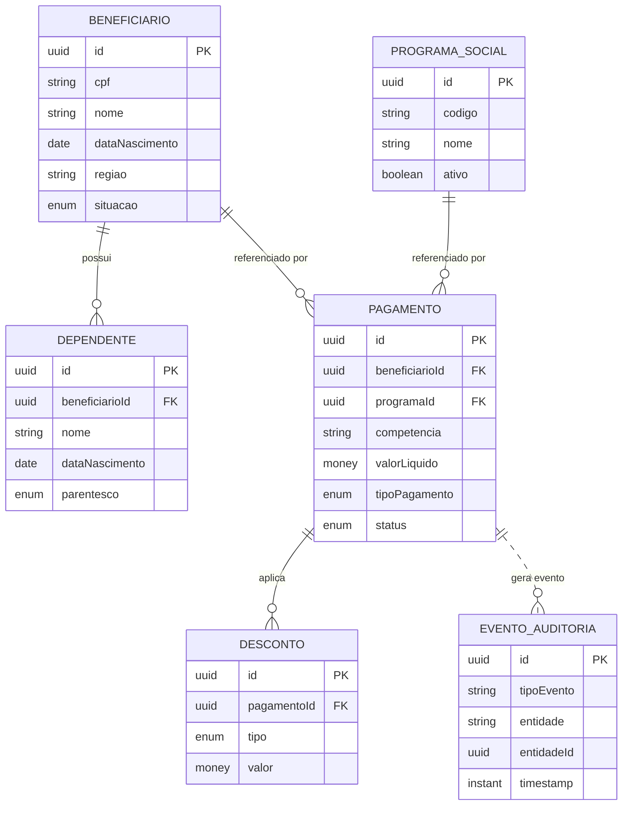

# Phase 1 — Data Model: Modernização SIFAP

> Entidades derivadas de [SPECIFICATION.md](SPECIFICATION.md) e dos DDMs legados, aplicando ADR-001 (Cálculo sem estado), ADR-002 (PE→`@OneToMany`) e ADR-003 (auditoria via porta). Tipos monetários são `Money` (BigDecimal, escala 2, **truncado** — REQ-019). CPF é Value Object com validação mod-11 (REQ-001/002). **Fórmulas financeiras não fazem parte do modelo de dados** e permanecem deferidas (ver [research.md](research.md) D-01..D-03).

## Agregados raiz e ownership

| Agregado | Bounded context dono | DDM legado | Escritores |
| --- | --- | --- | --- |
| `Beneficiario` | Cadastro de Beneficiários | BENEFICIARIO | Cadastro |
| `ProgramaSocial` | Programas Sociais e Elegibilidade | PROGRAMA-SOCIAL | Programas |
| `Pagamento` | Processamento de Pagamentos | PAGAMENTO | **só** Pagamentos (ADR-001) |
| `EventoAuditoria` | Relatórios e Auditoria | AUDITORIA | **só** via porta `AuditLog.record()` (ADR-003) |

> O Cálculo de Benefícios **não tem agregado transacional** — é motor sem estado; seus parâmetros de cálculo (quando confirmados) serão configuração, não tabela de negócio.

---

## 1. Beneficiario (Cadastro)

**Origem:** DDM BENEFICIARIO · CADBENEF, CADDEPEND, VALBENEF, VALDOCS · REQ-001 a REQ-011

| Campo | Tipo | Regras / Origem |
| --- | --- | --- |
| `id` | UUID (PK) | substitui chave técnica legada |
| `cpf` | `CPF` (VO, único) | validação mod-11 — REQ-001/002; mascarado em log/exibição |
| `nome` | String | obrigatório — REQ-003 |
| `dataNascimento` | LocalDate | usado em elegibilidade — REQ-012..014 |
| `regiao` | String/código | usado em regras regionais; exceção região 99 (ADR-005, OQ-007) |
| `situacao` | enum `SituacaoBeneficiario` | A (ativo) / outras — confirmar conjunto |
| `dependentes` | `List<Dependente>` `@OneToMany` | PE legado — ADR-002; REQ-009/010/011 |
| `dataCadastro` / `dataAtualizacao` | Instant | auditoria temporal |

**Regras de validação:**
- CPF válido (mod-11) e único — REQ-001/002.
- Campos obrigatórios na criação — REQ-003.
- Quantidade/validade de dependentes conforme REQ-009/010/011 (limites a confirmar se houver mistério associado).

### 1.1 Dependente (entidade filha)

**Origem:** PE de DEPENDENTES (ADR-002) · REQ-009/010/011

| Campo | Tipo | Regras |
| --- | --- | --- |
| `id` | UUID (PK) | |
| `beneficiarioId` | UUID (FK) | pertence a um `Beneficiario` |
| `nome` | String | obrigatório |
| `dataNascimento` | LocalDate | usado em elegibilidade do dependente |
| `parentesco` | enum | conjunto a confirmar |

---

## 2. ProgramaSocial (Programas e Elegibilidade)

**Origem:** DDM PROGRAMA-SOCIAL · CADPROG, VALELEG · REQ-012 a REQ-017

| Campo | Tipo | Regras / Origem |
| --- | --- | --- |
| `id` | UUID (PK) | |
| `codigo` | String (único) | identificação do programa |
| `nome` | String | obrigatório |
| `criteriosElegibilidade` | objeto/embeddable | parametriza idade, renda, região — REQ-012..016 |
| `ativo` | boolean | controla disponibilidade |
| `vigenciaInicio` / `vigenciaFim` | LocalDate | janela de vigência |

**Regras de validação / elegibilidade (confirmadas):**
- Avaliação de elegibilidade por critérios do programa — REQ-012..016.
- Exceções regionais (ex.: região 99) tratadas como exceção explícita e auditada — ADR-005 (especificação detalhada **deferida**, OQ-007).

> A **avaliação** de elegibilidade é exposta como porta síncrona `ElegibilidadeService.avaliar(beneficiario, programa)` consumida por outros contextos (R-05).

---

## 3. Pagamento (Processamento de Pagamentos)

**Origem:** DDM PAGAMENTO · BATCHPGT, BATCHCON · REQ-025 a REQ-029 · ADR-001

| Campo | Tipo | Regras / Origem |
| --- | --- | --- |
| `id` | UUID (PK) | |
| `beneficiarioId` | UUID (FK lógico) | referência ao beneficiário |
| `programaId` | UUID (FK lógico) | referência ao programa |
| `competencia` | YearMonth | mês de referência da folha |
| `valorBase` | `Money` | resultado do motor de Cálculo (fórmula **deferida** D-01) |
| `valorCorrecao` | `Money` | correção monetária (ordem resolvida por ADR-001) |
| `descontos` | `List<Desconto>` `@OneToMany` | PE legado — ADR-002; teto 30% + exceção judicial (REQ-021/022) |
| `valorLiquido` | `Money` | base + correção − descontos (truncado, REQ-019) |
| `tipoPagamento` | enum | mensal / `D` 13º (gatilho **deferido** D-02) |
| `status` | enum `StatusPagamento` | `G`→`P`/`D`/`E` (R-10; enum aberto até confirmação) |
| `dataGeracao` | Instant | |
| `dataConciliacao` | Instant (nullable) | preenchida na conciliação CNAB — REQ-027/028 |

**Regras de validação (confirmadas):**
- Geração da folha ordenada por **CPF** — REQ-025 (contrato de integração).
- Teto de desconto **30%** da renda; exceção por ordem judicial pode exceder — REQ-021/022.
- Conciliação com retorno bancário atualiza `status` e `dataConciliacao` — REQ-027/028.
- Ao concluir pagamento/conciliação, publica evento consumido pela Auditoria (ADR-003/004).

**Deferido:** fórmula de `valorBase` (D-01), 13º (D-02), faixas de `Desconto` (D-03), semântica precisa dos códigos de `status` (R-10).

### 3.1 Desconto (entidade filha)

**Origem:** PE de DESCONTOS (ADR-002) · CALCDSCT · REQ-021/022

| Campo | Tipo | Regras |
| --- | --- | --- |
| `id` | UUID (PK) | |
| `pagamentoId` | UUID (FK) | |
| `tipo` | enum | ordinário / judicial (judicial pode exceder teto) |
| `valor` | `Money` | |
| `origem` | String | fonte da verdade da faixa **deferida** (D-03) |

---

## 4. EventoAuditoria (Relatórios e Auditoria)

**Origem:** DDM AUDITORIA · BATCHCON, RELAUDIT · REQ-028/029/032 · ADR-003

| Campo | Tipo | Regras / Origem |
| --- | --- | --- |
| `id` | UUID (PK) | |
| `tipoEvento` | String/enum | ex.: PAGAMENTO_CONCILIADO, CADASTRO_ALTERADO |
| `entidade` | String | agregado afetado |
| `entidadeId` | UUID | id do agregado afetado |
| `usuario` | String | autor da ação (mascarar se sensível) |
| `dadosAntes` / `dadosDepois` | JSONB (nullable) | snapshot; CPF mascarado |
| `timestamp` | Instant | append-only |

**Regras:**
- **Append-only** — sem update/delete; gravado **somente** via porta `AuditLog.record(evento)` (ADR-003).
- Consumidores publicam eventos de domínio que a Auditoria materializa (ADR-004) com idempotência (outbox).

**Deferido:** política de exibição/retenção de exclusões `EX` (D-05 / OQ-009).

---

## Diagrama de relacionamentos

> **Decisão da equipe (pendente):** confirmar conjuntos de enum (`situacao`, `parentesco`, `status`, `tipoPagamento`) contra o legado antes de fixar migrations; e resolver as Open Questions D-01..D-06 antes de implementar cálculo/relatórios financeiros.
